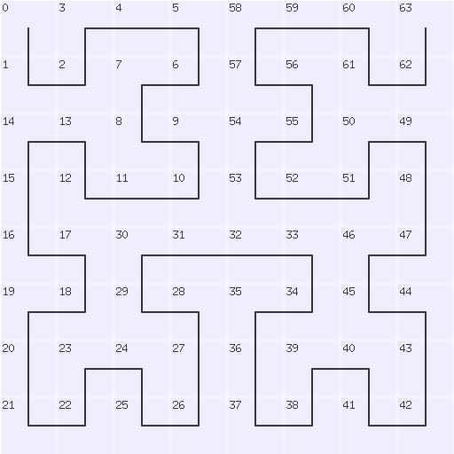
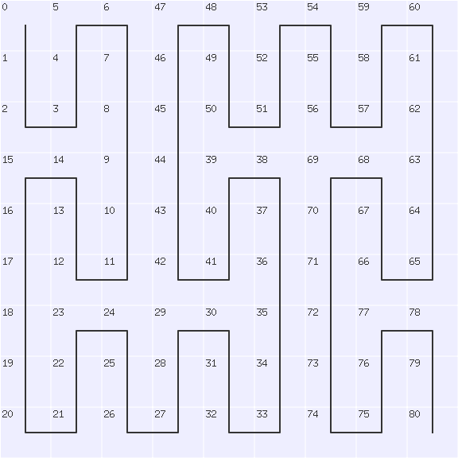
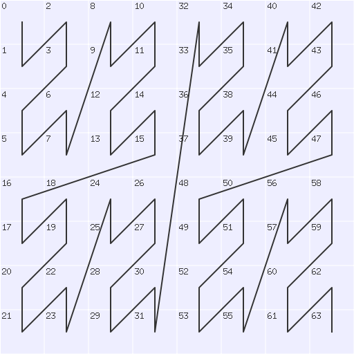
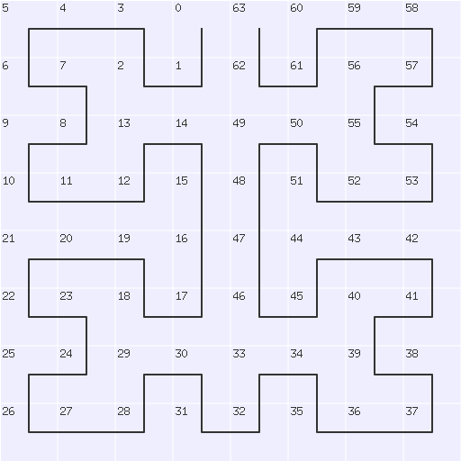
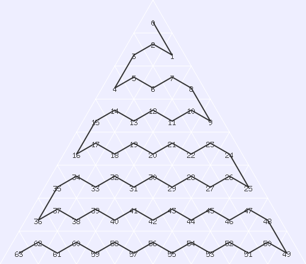
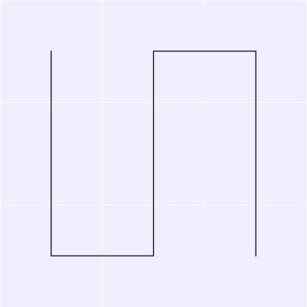
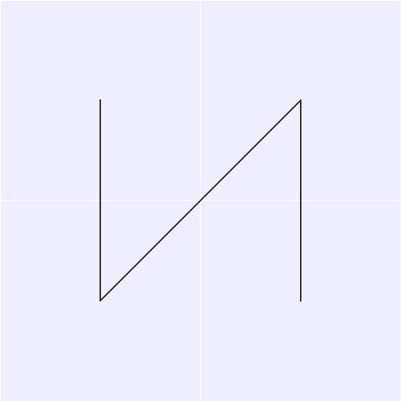
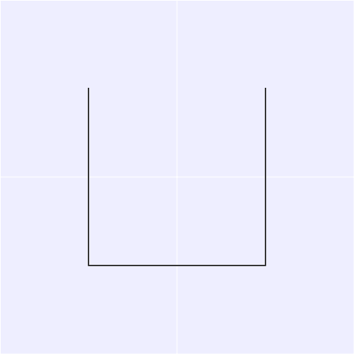
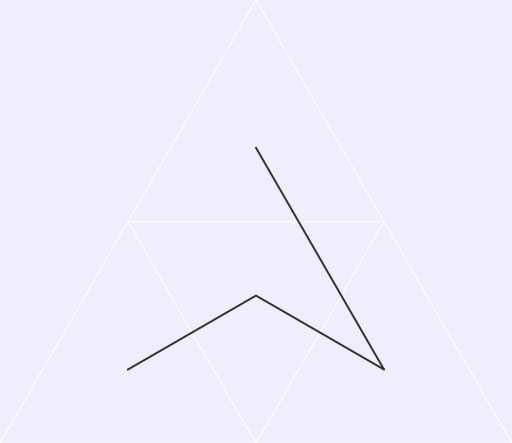
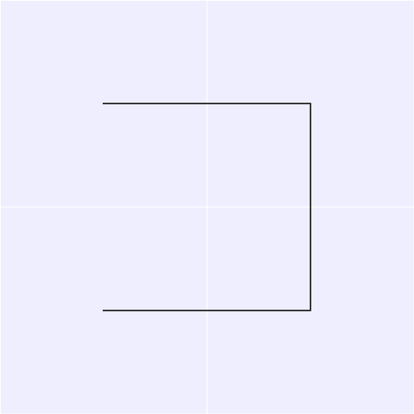

# Hilbert [](https://github.com/bramp/hilbert/actions/workflows/test.yml) [](https://coveralls.io/github/bramp/hilbert) [](https://goreportcard.com/report/github.com/bramp/hilbert) [](https://godoc.org/github.com/bramp/hilbert) [](https://libraries.io/github/bramp/hilbert)


Go package for mapping values to and from space-filling curves, such as
Hilbert, Peano, Morton, Moore, Snake, and Gosper curves.



[Documentation available here](https://godoc.org/github.com/bramp/hilbert)

*Note: This project was previously hosted at [github.com/google/hilbert](https://github.com/google/hilbert) but has moved to [github.com/bramp/hilbert](https://github.com/bramp/hilbert).*

*This is not an official Google product (experimental or otherwise), it is just code that happens to be owned by Google.*

## Supported Curves

| Curve | Visual | Description |
| :--- | :---: | :--- |
| **Hilbert** |  | **Pros:** Excellent spatial locality; no large jumps.<br>**Cons:** Slightly more complex to compute than Morton.<br>**Applications:** Spatial indexing (e.g., Google Maps), range queries, and texture mapping. |
| **Peano** |  | **Pros:** The original SFC; provides a different granularity.<br>**Cons:** Limited to power-of-3 dimensions ($3 \times 3, 9 \times 9$, etc.).<br>**Applications:** Ternary-based data structures and theoretical studies. |
| **Morton** |  | **Pros:** Extremely fast (bit-interleaving).<br>**Cons:** Poorer locality due to large "jumps."<br>**Applications:** Database partitioning (e.g., DynamoDB), GPU memory layouts, and high-speed indexing. |
| **Moore** |  | **Pros:** Closed-loop; start and end points are adjacent.<br>**Cons:** Similar complexity to Hilbert.<br>**Applications:** Image scanning, cyclic traversals, and sensor path planning. |
| **Sierpinski** |  | **Pros:** Highly symmetrical; continuous closed curve.<br>**Cons:** Uses a triangular grid.<br>**Applications:** Traveling Salesman Problem heuristics and parallel grid refinement. |
| **Snake** |  | **Pros:** Simplest possible traversal.<br>**Cons:** Poor locality; large jumps at the end of rows.<br>**Applications:** Raster scanning and baseline benchmarks. |
| **Gosper** |  | **Pros:** Fills hexagonal grids; beautiful fractal structure.<br>**Cons:** Complex mapping; uses base-7 axial coordinates.<br>**Applications:** Hexagonal data structures, image processing, and simulations. |

## How to use

Install:

```bash
go get github.com/bramp/hilbert
```

Example:

```go
import "github.com/bramp/hilbert"
	
// Create a Hilbert curve for mapping to and from a 16 by 16 space.
s, err := hilbert.NewHilbert(16)

// Create a Peano curve for mapping to and from a 27 by 27 space.
//s, err := hilbert.NewPeano(27)

// Now map one dimension numbers in the range [0, N*N-1], to an x,y
// coordinate on the curve where both x and y are in the range [0, N-1].
x, y, err := s.Map(t)

// Also map back from (x,y) to t.
t, err := s.MapInverse(x, y)
```

## Demo

The demo directory contains examples of how to draw images of these curves, as well
as animations of varying sizes.

| Hilbert | Peano |
| :---: | :---: |
|  |  |
| **Morton** | **Moore** |
|  |  |
| **Sierpinski** | **Snake** |
|  |  |
| **Gosper** | |
|  | |

To regenerate these images and optimize them, run:

```bash
make images
```

## Licence (Apache 2)

```
Copyright 2015 Google Inc. All Rights Reserved.

Licensed under the Apache License, Version 2.0 (the "License");
you may not use this file except in compliance with the License.
You may obtain a copy of the License at

http://www.apache.org/licenses/LICENSE-2.0

Unless required by applicable law or agreed to in writing, software
distributed under the License is distributed on an "AS IS" BASIS,
WITHOUT WARRANTIES OR CONDITIONS OF ANY KIND, either express or implied.
See the License for the specific language governing permissions and
limitations under the License.
```
